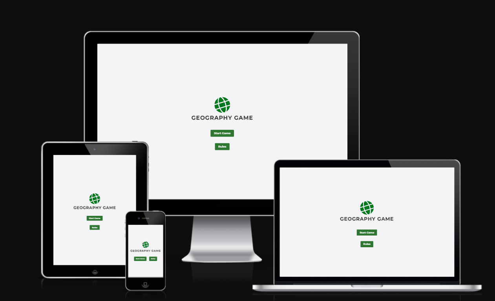

# Geography game

Welcome to Geography Game! This project is a web-based quiz game that tests players' knowledge of global geography in a fun and engaging manner.

## Goal

The Geography Quiz Game aims to give an interesting and instructive experience for players of all ages who want to learn about nations, capitals, monuments, and other topics from across the world. Answering multiple-choice questions allows users to push themselves, increase their geography knowledge, and compete against friends to see who can get the greatest score.

[Deployed site here](<https://capricornog.github.io/Geography-game/>)

## Table of content
- [Geography game](#geography-game)
  - [Goal](#goal)
  - [Table of content](#table-of-content)
  - [UX Design](#ux-design)
    - [User Stories](#user-stories)
    - [User Goal](#user-goal)
    - [How to meet user requiremnt](#how-to-meet-user-requiremnt)
    - [structure for the website:](#structure-for-the-website)

## UX Design
### User Stories
- As a player, I want to be able to start a new game easily, so I can begin playing straight away.
- As a player, I want to receive multiple-choice questions about world geography, so I can test my knowledge.
- As a player, I want each question to have a timer, so I can answer quickly and feel challenged.
- As a player, I want to know if my answer is correct or incorrect, so I can learn from my mistakes.
- As a player, I want to see my current score during the game, so I can track my progress.
- As a player, I want the game to end after answering all questions, so I can see my final score.
- As a player, I want to be able to restart the game after finishing, so I can play again and try to improve my score.
- As a player, I want the game to be visually appealing and easy to navigate, so I can enjoy the experience.
- As a player, I want the game to be accessible on different devices and screen sizes, so I can play on my preferred device.
- As a player, I want to have the option to view the rules of the game, so I can understand how to play before starting.

### User Goal
- Test Knowledge: Users wish to assess their knowledge of world geography by answering questions on countries, capitals, landmarks, and other geographical facts.
- Learn: By playing the quiz game, users hope to acquire new facts and knowledge about globe geography.
- Challenge: Users expect a demanding experience that will test their brains and problem-solving abilities.
- Improve Geography Skills: Through games, users hope to have a better grasp of global geography.

### How to meet user requiremnt
1.	Start a New Game Easily:
-	Ensure a prominent "Start Game" button on the homepage for easy access.
-	Ensure the game loads quickly and smoothly without any technical issues.
2.	Receive Multiple-Choice Questions:
-	Design a system to randomly select questions from a pool of geography-related questions.
-	Display questions in a clear and readable format, with multiple-choice answers presented clearly.
3.	Timer for Each Question:
-	Implement a timer for each question to create a sense of urgency and challenge.
-	Display the remaining time prominently to keep players informed.
4.	Know If Answer Is Correct/Incorrect:
-	Provide immediate feedback after each question, indicating whether the answer selected was correct or incorrect.
-	Highlight the correct answer if the player's response was incorrect to aid learning.
5.	See Current Score During the Game:
-	Display the current score prominently on the game page, updating it in real-time as the player progresses.
-	Ensure that the scoring system accurately reflects the player's performance.
6.	End Game After Answering All Questions:
-	Implement logic to end the game automatically after the player has answered all questions in the quiz.
-	Direct the player to the end-game page to view their final score and personalised message.
7.	Restart the Game After Finishing:
-	Provide an option to restart the game on the end-game page, allowing players to play again immediately.
-	Ensure that restarting the game resets the score and presents a new set of questions.
8.	Visually Appealing and Easy to Navigate:
-	Design the website with a clean and intuitive user interface, using visually appealing graphics and layouts.
-	Ensure consistent navigation elements across all pages for easy access to game features.
9.	Accessible on Different Devices:
-	Implement responsive design principles to ensure that the website is accessible and functional across various devices and screen sizes.
-	Test the website on different browsers and devices to ensure compatibility and optimal performance.
10.	View the Rules of the Game:
-	Provide a dedicated "Rules" page where players can learn about the game mechanics, scoring system, and any specific rules or instructions.
-	Include clear and concise explanations to help users understand how to play the game effectively.

### structure for the website:
1.	Homepage (index.html):
-	Welcome message and game logo.
-	Start Game button.
-	Option to view game rules.
2.	Game Page (start-game.html):
-	Display the game interface.
-	Timer display for each question.
-	Score display.
-	Question number indicator.
-	Question prompt.
-	Multiple-choice options for answers.
-	Navigation buttons to return to the homepage or view game rules.
3.	Rules Page (rules.html):
-	Introduction to the game.
-	Explanation of game rules.
-	Clarification of scoring system.
-	Instructions on how to play.
-	Navigation buttons to start the game or return to the homepage.
4.	End Game Page (end-game.html):
-	Display the final score.
-	Personalised message based on the score achieved.
-	Option to restart the game.
-	Option to return to the homepage.
5.	Assets Folder:
-	CSS Folder:
-	Stylesheet (styles.css) for styling the website.
-	JS Folder:
-	JavaScript files (script.js and end.js) for implementing game logic and functionality.

