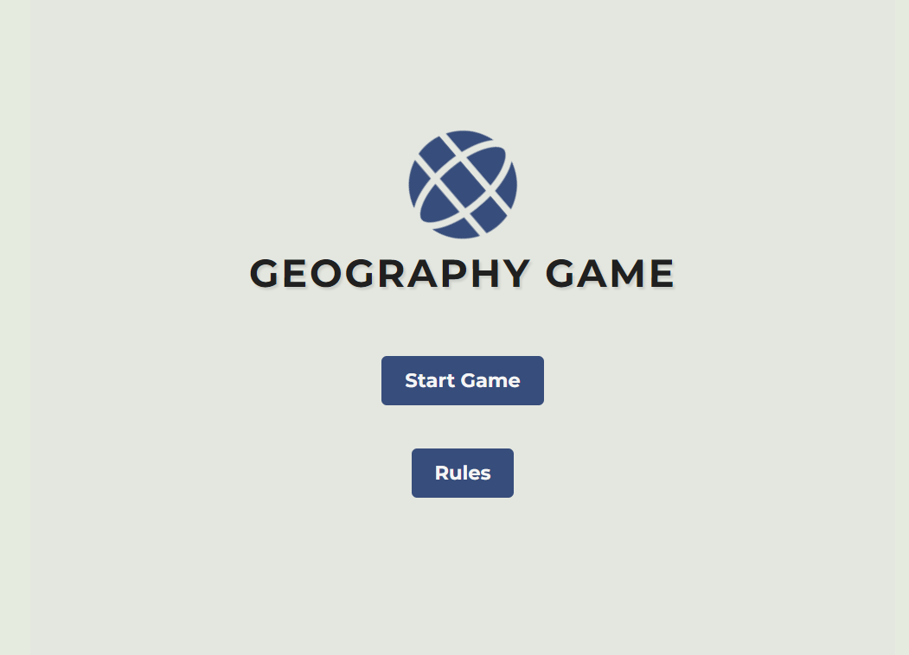
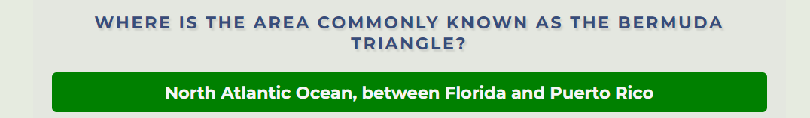
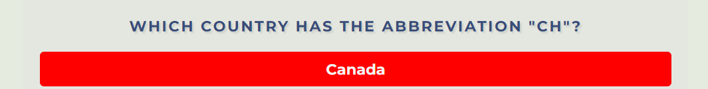

# Geography game

Welcome to Geography Game! This project is a web-based quiz game that tests players' knowledge of global geography in a fun and engaging manner.

## Goal

The Geography Quiz Game aims to give an interesting and instructive experience for players of all ages who want to learn about nations, capitals, monuments, and other topics from across the world. Answering multiple-choice questions allows users to push themselves, increase their geography knowledge, and compete against friends to see who can get the greatest score.

[Deployed site here](<https://capricornog.github.io/Geography-game/>)

## Table of content
- [Geography game](#geography-game)
  - [Goal](#goal)
  - [Table of content](#table-of-content)
  - [UX Design](#ux-design)
    - [User Stories](#user-stories)
    - [User Goal](#user-goal)
    - [How to meet user requiremnt](#how-to-meet-user-requiremnt)
    - [structure for the website:](#structure-for-the-website)
    - [Wireframe](#wireframe)
  - [Design Choice](#design-choice)
    - [Colour Scheme](#colour-scheme)
    - [Icons](#icons)
    - [Fonts](#fonts)
    - [Structure](#structure)
  - [Logic](#logic)
  - [Features](#features)
    - [Homepage Features:](#homepage-features)
    - [Game Page Features:](#game-page-features)
    - [Rules Page Features:](#rules-page-features)
    - [End Game Page Features:](#end-game-page-features)
    - [Styling and Design Features:](#styling-and-design-features)
    - [JavaScript Functionality Features:](#javascript-functionality-features)
  - [Future Enhancements](#future-enhancements)
  - [Technologies-used](#technologies-used)
  - [Languages](#languages)
  - [Libraries \& Framework](#libraries--framework)
  - [Tools](#tools)
  - [Testing](#testing)
  - [Deployment](#deployment)
  - [Credit](#credit)

## UX Design
### User Stories
- As a player, I want to be able to start a new game easily, so I can begin playing straight away.
- As a player, I want to receive multiple-choice questions about world geography, so I can test my knowledge.
- As a player, I want each question to have a timer, so I can answer quickly and feel challenged.
- As a player, I want to know if my answer is correct or incorrect, so I can learn from my mistakes.
- As a player, I want to see my current score during the game, so I can track my progress.
- As a player, I want the game to end after answering all questions, so I can see my final score.
- As a player, I want to be able to restart the game after finishing, so I can play again and try to improve my score.
- As a player, I want the game to be visually appealing and easy to navigate, so I can enjoy the experience.
- As a player, I want the game to be accessible on different devices and screen sizes, so I can play on my preferred device.
- As a player, I want to have the option to view the rules of the game, so I can understand how to play before starting.

### User Goal
- Test Knowledge: Users wish to assess their knowledge of world geography by answering questions on countries, capitals, landmarks, and other geographical facts.
- Learn: By playing the quiz game, users hope to acquire new facts and knowledge about globe geography.
- Challenge: Users expect a demanding experience that will test their brains and problem-solving abilities.
- Improve Geography Skills: Through games, users hope to have a better grasp of global geography.

### How to meet user requiremnt
1.	Start a New Game Easily:
-	Ensure a prominent "Start Game" button on the homepage for easy access.
-	Ensure the game loads quickly and smoothly without any technical issues.
2.	Receive Multiple-Choice Questions:
-	Design a system to randomly select questions from a pool of geography-related questions.
-	Display questions in a clear and readable format, with multiple-choice answers presented clearly.
3.	Timer for Each Question:
-	Implement a timer for each question to create a sense of urgency and challenge.
-	Display the remaining time prominently to keep players informed.
4.	Know If Answer Is Correct/Incorrect:
-	Provide immediate feedback after each question, indicating whether the answer selected was correct or incorrect.
-	Highlight the correct answer if the player's response was incorrect to aid learning.
5.	See Current Score During the Game:
-	Display the current score prominently on the game page, updating it in real-time as the player progresses.
-	Ensure that the scoring system accurately reflects the player's performance.
6.	End Game After Answering All Questions:
-	Implement logic to end the game automatically after the player has answered all questions in the quiz.
-	Direct the player to the end-game page to view their final score and personalised message.
7.	Restart the Game After Finishing:
-	Provide an option to restart the game on the end-game page, allowing players to play again immediately.
-	Ensure that restarting the game resets the score and presents a new set of questions.
8.	Visually Appealing and Easy to Navigate:
-	Design the website with a clean and intuitive user interface, using visually appealing graphics and layouts.
-	Ensure consistent navigation elements across all pages for easy access to game features.
9.	Accessible on Different Devices:
-	Implement responsive design principles to ensure that the website is accessible and functional across various devices and screen sizes.
-	Test the website on different browsers and devices to ensure compatibility and optimal performance.
10.	View the Rules of the Game:
-	Provide a dedicated "Rules" page where players can learn about the game mechanics, scoring system, and any specific rules or instructions.
-	Include clear and concise explanations to help users understand how to play the game effectively.

### structure for the website:
1.	Homepage (index.html):
-	Welcome message and game logo.
-	Start Game button.
-	Option to view game rules.
2.	Game Page (start-game.html):
-	Display the game interface.
-	Timer display for each question.
-	Score display.
-	Question number indicator.
-	Question prompt.
-	Multiple-choice options for answers.
-	Navigation buttons to return to the homepage or view game rules.
3.	Rules Page (rules.html):
-	Introduction to the game.
-	Explanation of game rules.
-	Clarification of scoring system.
-	Instructions on how to play.
-	Navigation buttons to start the game or return to the homepage.
4.	End Game Page (end-game.html):
-	Display the final score.
-	Personalised message based on the score achieved.
-	Option to restart the game.
-	Option to return to the homepage.
5.	Assets Folder:
-	CSS Folder:
-	Stylesheet (styles.css) for styling the website.
-	JS Folder:
-	JavaScript files (script.js and end.js) for implementing game logic and functionality.

### Wireframe
Home Page

Rules Page

Start-game Page

End Page

## Design Choice
### Colour Scheme

[Coolors](<https://coolors.co/>) for the colours.

### Icons

[Font Awesome](<https://fontawesome.com/>), only icon is the globe.

### Fonts

Font-family used  'Montserrat', sans-serif.

### Structure

|Screen Size|Breakpoint|
|:---:|:---:|
|x-small|< 480px|
|small|=> 480px|
|large|=>768px|

## Logic

1.	Homepage (index.html):
-	Displays a welcome message and the logo of the game.
-	Provides buttons to navigate to the game page or the rules page.

2.	Game Page (start-game.html):

-	Displays the game interface where questions are shown.
-	Each question has multiple choice options for answers.

-	Users have a set time limit to answer each question.

-	After answering, the user is shown if the answer was correct or incorrect.

-	Score is updated based on correct answers.

-	Once all questions are answered, the user is redirected to the end game page.

3.	Rules Page (rules.html):
-	Presents the rules of the game to the user.
-	Provides guidance on how to play, including time limits and scoring.

4.	End Game Page (end-game.html):
-	Displays the final score achieved by the user.
-	Provides a personalized message based on the score achieved.
-	Allows users to restart the game or return to the homepage.

5.	CSS Styling:
-	Ensures a consistent and visually appealing layout across all pages.
-	Utilizes CSS animations for interactive elements such as buttons and logo rotation.
-	Implements responsive design to adapt to various screen sizes.
6.	JavaScript Functionality:
-	Fetches questions from an external API (or uses backup questions if API call fails).
-	Handles the display of questions and options dynamically.
-	Implements a timer for each question and updates the UI accordingly.
-	Checks user-selected answers against correct answers and updates the score.
-	Manages navigation between pages and stores/retrieves the user's final score.

## Features
###	Homepage Features:
-	Welcome message and game logo.
-	Start Game button to initiate the game.
-	Rules button to view the game rules.
###	Game Page Features:
-	Displays questions one by one with multiple-choice options.
-	Timer indicating the time remaining to answer each question.
-	Feedback on selected answers (correct or incorrect).
-	Score display showing the current score.
-	Question number indicator to track progress.
-	Navigation buttons to return to the homepage or view the rules.
###	Rules Page Features:
-	Provides clear instructions on how to play the game.
-	Lists out the rules, including time limits and scoring system.
-	Encourages users to test their geography knowledge.
###	End Game Page Features:
-	Displays the final score achieved by the user.
-	Presents a personalised message based on the score attained.
-	Allows users to restart the game or return to the homepage.
###	Styling and Design Features:
-	Consistent design elements across all pages for a cohesive user experience.
-	Responsive design to ensure compatibility with various devices and screen sizes.
-	Use of CSS animations for interactive elements such as buttons and logo rotation.
-	Clear typography and colour scheme for readability and visual appeal.
###	JavaScript Functionality Features:
-	Fetches questions from an external API (or uses backup questions if API call fails).
-	Dynamically displays questions and options based on the retrieved data.
-	Implements a timer for each question to create a sense of urgency.
-	Validates user-selected answers against correct answers and updates the score accordingly.
-	Manages navigation between pages and stores/retrieves the user's final score.

## Future Enhancements

While the current version of the Geography Game offers an engaging experience, there are several features and enhancements that could be added in the future to further enhance the gameplay and user interaction. Some potential additions include:

1.	Difficulty Levels: Allow users to choose between different difficulty levels (easy, medium, hard) to cater to varying levels of geography knowledge and challenge.
2.	Hint System: Implement a hint system that provides users with clues or additional information to help them answer questions if they're stuck.
3.	Category Selection: Enable users to select specific categories or topics within geography (e.g., capitals, landmarks, rivers) to focus on areas of interest.
4.	Multiplayer Mode: Introduce a multiplayer mode where users can compete against friends or other players online in real-time quizzes.
5.	Leaderboard: Incorporate a leaderboard feature to showcase high scores and rankings among players, promoting competition and engagement.
6.	Visual Enhancements: Add interactive maps, images, or diagrams related to each question to make the game visually stimulating and educational.
7.	Sound Effects and Music: Include sound effects for correct and incorrect answers, as well as background music to enhance the overall gaming experience.
8.	Customization Options: Allow users to customize their game experience by adjusting settings such as timer duration, number of questions, or visual themes.

## Technologies-used
  
  ## Languages
* [HTML](https://en.wikipedia.org/wiki/HTML "HTML")
* [CSS](https://en.wikipedia.org/wiki/CSS "CSS")
* [JavaScript](https://en.wikipedia.org/wiki/JavaScript)

## Libraries & Framework
* [Google Fonts](https://fonts.google.com/ "Google Fonts")
* [Font Awesome library](https://fontawesome.com/ "Font Awesome")
## Tools
* [Coolors](<https://coolors.co/>)
* [Balsamiq](https://balsamiq.com/wireframes/ "Balsamiq")
* [npm](https://www.npmjs.com/)
* [Git](https://git-scm.com/)
* [GitHub](https://github.com/)
* [VS Code](https://code.visualstudio.com/)
  
## Testing

[Testing](testing.md)

## Deployment

Following writing the code then commiting and pushing to GitHub, this project was deployed using GitHub by the following steps.

* Navigate to the repository on github and click 'Settings'.
Then select 'Pages' on the side navigation.
* Select the 'None' dropdown, and then click 'master'.
* Click on the 'Save' button.
* Now the website is now live on <https://capricornog.github.io/Geography-game/>
* If any changes are required, they can be done, commited and pushed to GitHub and the changes will be updated.

## Credit