# Testing section
## Table of content
- [Testing section](#testing-section)
  - [Table of content](#table-of-content)
  - [Automated testing](#automated-testing)
    - [HTML validation with W3C Markup Validator](#html-validation-with-w3c-markup-validator)
    - [CSS validation with W3C CSS Validator](#css-validation-with-w3c-css-validator)
    - [JavaScript validation with JSHint](#javascript-validation-with-jshint)
      - [**script.js** JSHint Warnings](#scriptjs-jshint-warnings)
      - [**end.js** JSHint Warnings](#endjs-jshint-warnings)
    - [Accessibility using Lighthouse accessibility](#accessibility-using-lighthouse-accessibility)
  - [Manual Testing](#manual-testing)

## Automated testing

 ### HTML validation with [W3C Markup Validator](https://validator.w3.org/)
  |Pages|Outcome|Final|
  |:--:|:--:|:--:|
  |**index.html**|||
  |**start-game.html**| **Issue extra h2 to be removed**||
  |**rules.html**||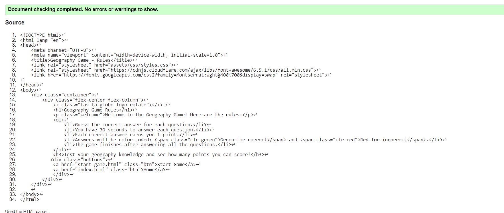|
  |**end-game.html**||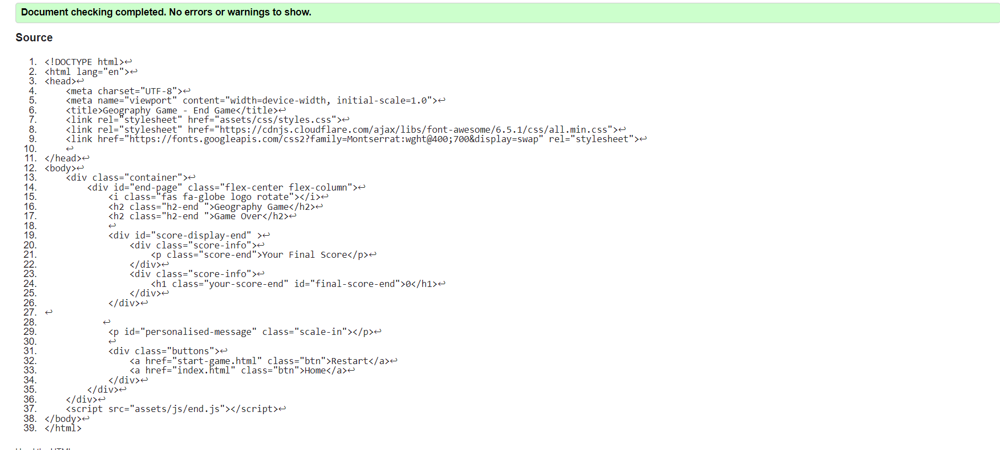|

HTML returns **no errors or warnings**.

  ### CSS validation with [W3C CSS Validator](https://jigsaw.w3.org/css-validator/)

  Validate **styles.css** on **W3C**.

  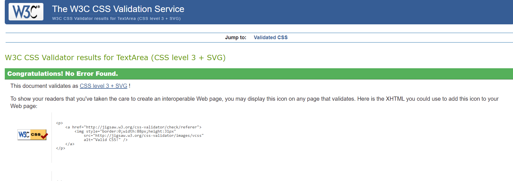

  CSS returns **no errors or warnings**.

  ### JavaScript validation with [JSHint](https://jshint.com/)

 **JSHint** 

 #### **script.js** JSHint Warnings 

The warnings received from JSHint mainly pertain to the use of ES6 features without explicitly specifying ES6 as the target version. Here's a breakdown of the warnings:
-	'const' and 'let' Declarations: The use of const and let declarations indicates ES6 usage. JSHint suggests explicitly specifying ES6 using esversion: 6 in the configuration.
-	Arrow Function Syntax: Arrow function syntax (() => {}) is also an ES6 feature. It is advisable to specify ES6 explicitly if arrow functions are used.
-	Spread Operator: The use of the spread operator (...) is an ES6 feature. It is recommended to target ES6 explicitly in the configuration.
-	Template Literal Syntax: Template literal syntax (backticks) is an ES6 feature. It is advisable to specify ES6 explicitly if template literals are used.|

script.js

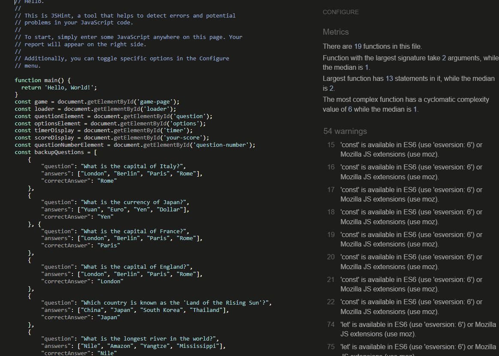

to do not have warning I add the comment 

      /* jshint esversion: 6 */

At the end of my script file, **no errors** and **no warnings** are then returing.

update script.js

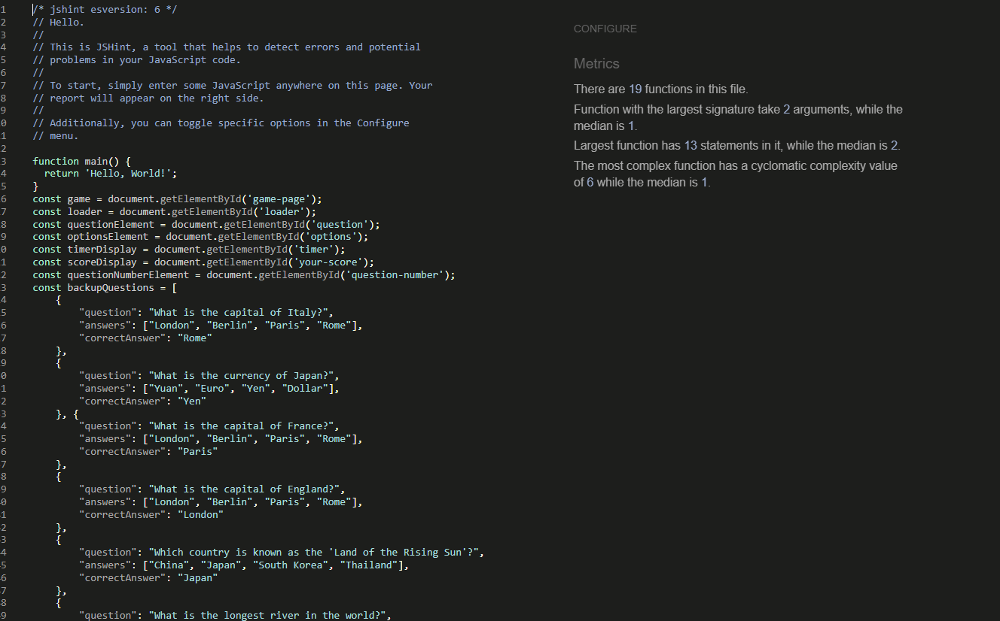

#### **end.js** JSHint Warnings 

 **no errors** and **no warnings** are then returing.

 

end.js

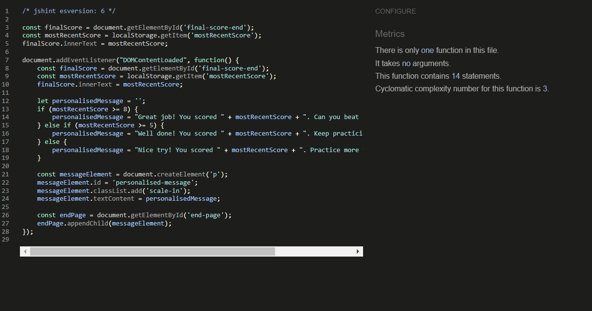

### Accessibility using [Lighthouse accessibility](https://developer.chrome.com/docs/lighthouse/accessibility/)

|Pages|mobile|Desktop|
  |:--:|:--:|:--:|
  |**index.html**|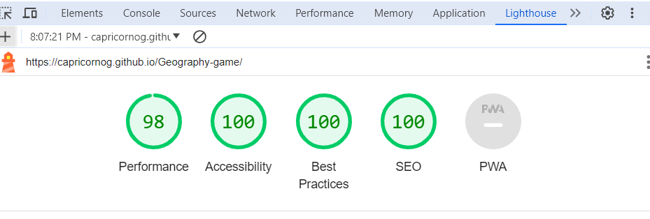|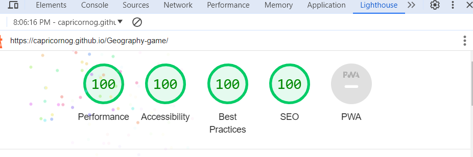|
  |**start-game.html**|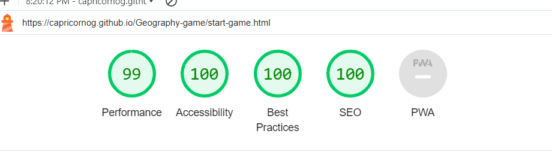|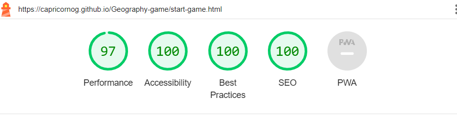|
  |**rules.html**||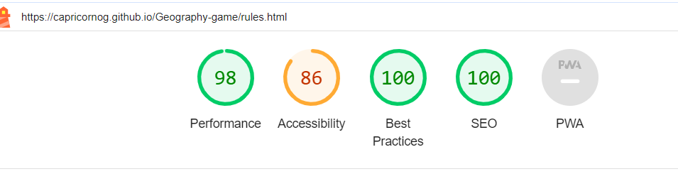|
  |**end-game.html**|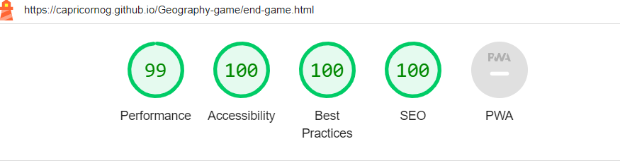|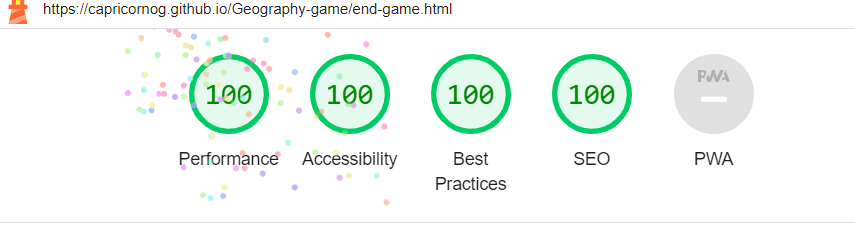|

## Manual Testing

Manual test cases based on the **user stories** .

|User Story|	Test Case|	Steps|	Expected Result|Outcome|
|:--:|:--:|:--:|:---:|:---:|
|Start a New Game|	Open the game's homepage.  Click on the "Start Game" button.|1. Open the game's homepage.  2. Click on the "Start Game" button.	|The game should start, and the player should be directed to the game page with the first question displayed.||
|Receive Multiple-Choice Questions|	Start a new game.  Answer the displayed questions.	|1. Start a new game.  2. Answer the displayed questions.	|The player should receive multiple-choice questions related to world geography.  Each question should have multiple answer options for the player to choose from.| image|
|Timer for Each Question	|Start a new game.  Observe the timer for each question.	|1. Start a new game.  2. Observe the timer for each question.	|A timer should be displayed for each question, indicating the remaining time for the player to answer.  The timer should count down from the specified time limit (e.g., 30 seconds).| image|
|Know Correctness of Answers|Start a new game.  Answer questions correctly and incorrectly. 	|1. Start a new game.  2. Answer questions correctly and incorrectly. 	|After submitting an answer, the player should receive immediate feedback indicating whether the answer is correct or incorrect.  Correct answers should be highlighted in green, and incorrect answers should be highlighted in red. | image|
|Track Current Score	|Start a new game.  Answer questions and observe the score. 	|1. Start a new game.  2. Answer questions and observe the score. 	|The player's current score should be displayed and updated after answering each question.  Each correct answer should increment the score by one point. | image|
|End Game and View Final Score	|Answer all questions in the game.  Observe the end game screen. |1. Answer all questions in the game.  2. Observe the end game screen. 	|After answering all questions, the game should end automatically.  The player should be directed to the end game screen, where the final score is displayed. | image|
