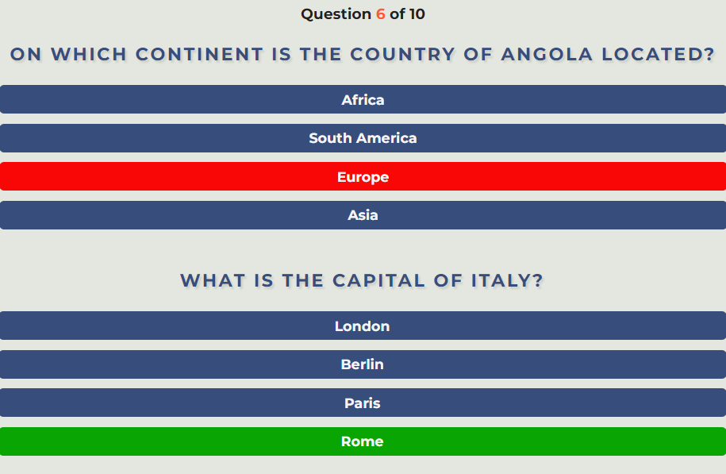
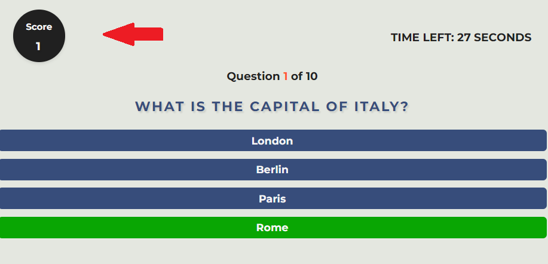
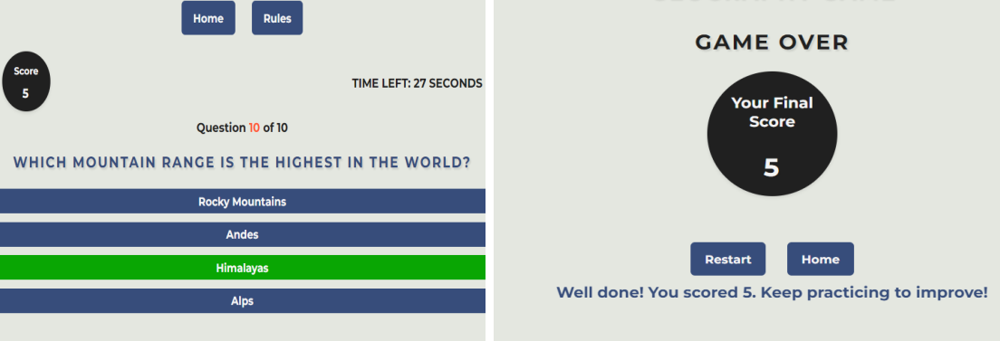

# Testing section
## Table of content
- [Testing section](#testing-section)
  - [Table of content](#table-of-content)
  - [Automated testing](#automated-testing)
    - [HTML validation with W3C Markup Validator](#html-validation-with-w3c-markup-validator)
    - [CSS validation with W3C CSS Validator](#css-validation-with-w3c-css-validator)
    - [JavaScript validation with JSHint](#javascript-validation-with-jshint)
      - [**script.js** JSHint Warnings](#scriptjs-jshint-warnings)
      - [**end.js** JSHint Warnings](#endjs-jshint-warnings)
    - [Accessibility using Lighthouse accessibility](#accessibility-using-lighthouse-accessibility)
  - [Manual Testing](#manual-testing)
    - [Testing plan for **User Stories** .](#testing-plan-for-user-stories-)
    - [Testing plan for **User Goal** .](#testing-plan-for-user-goal-)
    - [Testing plan for **Features** .](#testing-plan-for-features-)

## Automated testing

 ### HTML validation with [W3C Markup Validator](https://validator.w3.org/)
  |Pages|Outcome|Final|
  |:--:|:--:|:--:|
  |**index.html**|||
  |**start-game.html**| **Issue extra h2 to be removed**||
  |**rules.html**|||
  |**end-game.html**|||

HTML returns **no errors or warnings**.

  ### CSS validation with [W3C CSS Validator](https://jigsaw.w3.org/css-validator/)

  Validate **styles.css** on **W3C**.

  

  CSS returns **no errors or warnings**.

  ### JavaScript validation with [JSHint](https://jshint.com/)

 **JSHint** 

 #### **script.js** JSHint Warnings 

The warnings received from JSHint mainly pertain to the use of ES6 features without explicitly specifying ES6 as the target version. Here's a breakdown of the warnings:
-	'const' and 'let' Declarations: The use of const and let declarations indicates ES6 usage. JSHint suggests explicitly specifying ES6 using esversion: 6 in the configuration.
-	Arrow Function Syntax: Arrow function syntax (() => {}) is also an ES6 feature. It is advisable to specify ES6 explicitly if arrow functions are used.
-	Spread Operator: The use of the spread operator (...) is an ES6 feature. It is recommended to target ES6 explicitly in the configuration.
-	Template Literal Syntax: Template literal syntax (backticks) is an ES6 feature. It is advisable to specify ES6 explicitly if template literals are used.|

script.js

to do not have warning I add the comment 

      /* jshint esversion: 6 */

At the end of my script file, **no errors** and **no warnings** are then returing.

update script.js

#### **end.js** JSHint Warnings 

 **no errors** and **no warnings** are then returing.

 

end.js

### Accessibility using [Lighthouse accessibility](https://developer.chrome.com/docs/lighthouse/accessibility/)

|Pages|mobile|Desktop|
  |:--:|:--:|:--:|
  |**index.html**|||
  |**start-game.html**|||
  |**rules.html**|||
  |**end-game.html**|||

## Manual Testing

### Testing plan for **User Stories** .

|User Story|	Test Case|	Steps|	Expected Result|Outcome|
|:--:|:--:|:--:|:---:|:---:|
|Start a New Game|	Open the game's homepage.  Click on the "Start Game" button.|1. Open the game's homepage.  2. Click on the "Start Game" button.	|The game should start, and the player should be directed to the game page with the first question displayed.||
|Receive Multiple-Choice Questions|	Start a new game.  Answer the displayed questions.	|1. Start a new game.  2. Answer the displayed questions.	|The player should receive multiple-choice questions related to world geography.  Each question should have multiple answer options for the player to choose from.| |
|Timer for Each Question	|Start a new game.  Observe the timer for each question.	|1. Start a new game.  2. Observe the timer for each question.	|A timer should be displayed for each question, indicating the remaining time for the player to answer.  The timer should count down from the specified time limit (e.g., 30 seconds).| |
|Know Correctness of Answers|Start a new game.  Answer questions correctly and incorrectly. 	|1. Start a new game.  2. Answer questions correctly and incorrectly. 	|After submitting an answer, the player should receive immediate feedback indicating whether the answer is correct or incorrect.  Correct answers should be highlighted in green, and incorrect answers should be highlighted in red. | |
|Track Current Score	|Start a new game.  Answer questions and observe the score. 	|1. Start a new game.  2. Answer questions and observe the score. 	|The player's current score should be displayed and updated after answering each question.  Each correct answer should increment the score by one point. | |
|End Game and View Final Score	|Answer all questions in the game.  Observe the end game screen. |1. Answer all questions in the game.  2. Observe the end game screen. 	|After answering all questions, the game should end automatically.  The player should be directed to the end game screen, where the final score is displayed. | |

### Testing plan for **User Goal** .

| Test Scenario                                    | Test Case                                                           | Steps                                                                                  | Expected Result                                                                                               |
|--------------------------------------------------|---------------------------------------------------------------------|----------------------------------------------------------------------------------------|---------------------------------------------------------------------------------------------------------------|
| **Assess Knowledge**                            |                                                                   |                                                                                        |                                                                                                               |
|                                                  | Users attempt to answer questions on countries, capitals, landmarks, and other geographical facts. | 1. Start a new game.   2. Answer the displayed questions.                             | - The questions should cover a wide range of topics related to world geography.   - Users should feel challenged by the difficulty level of the questions.     |
| **Acquire New Knowledge**                       |                                                                   |                                                                                        |                                                                                                               |
|                                                  | Users play the quiz game to acquire new facts and knowledge about global geography. | 1. Start a new game.   2. Observe the questions and answers.   3. Note down any new facts learned during the game. | - Users should encounter questions that provide informative answers, expanding their knowledge of world geography. |
| **Experience Challenging Gameplay**             |                                                                   |                                                                                        |                                                                                                               |
|                                                  | Users expect a demanding experience that will test their brains and problem-solving abilities. | 1. Start a new game.   2. Observe the complexity of the questions.   3. Analyse the time limit provided for each question. | - Users should find the questions challenging enough to engage their problem-solving skills.   - The time limit for each question should add to the overall challenge without feeling too rushed. |
| **Improve Geography Skills**                    |                                                                   |                                                                                        |                                                                                                               |
|                                                  | Users hope to have a better grasp of global geography through playing the game. | 1. Start a new game.   2. Answer questions and observe performance.   3. Reflect on the knowledge gained during the game. | - Users should feel that their global geography skills have improved after playing the game, either through learning new facts or reinforcing existing knowledge. |

### Testing plan for **Features** .

| Feature                                                | Test Case                                                                       | Steps                                                                                                                                                                      | Expected Result                                                                                                                                                                                                                                                                                 |
|--------------------------------------------------------|---------------------------------------------------------------------------------|----------------------------------------------------------------------------------------------------------------------------------------------------------------------------|------------------------------------------------------------------------------------------------------------------------------------------------------------------------------------------------------------------------------------------------------------------------------------------------|
| **Homepage Features**                                 |                                                                                 |                                                                                                                                                                            |                                                                                                                                                                                                                                                                                                |
|                                                        | Welcome message and game logo.                                                  | 1. Open the game's homepage.   2. Observe the welcome message and game logo.                                                                                            | The welcome message and game logo should be prominently displayed on the homepage, welcoming the user to the game.                                                                                                                                                                            |
|                                                        | Start Game button to initiate the game.                                         | 1. Open the game's homepage.   2. Click on the "Start Game" button.                                                                                                       | Clicking on the "Start Game" button should initiate the game and direct the player to the game page with the first question displayed.                                                                                                                                                      |
|                                                        | Rules button to view the game rules.                                            | 1. Open the game's homepage.   2. Click on the "Rules" button.                                                                                                            | Clicking on the "Rules" button should navigate the user to the rules page where they can view the instructions on how to play the game.                                                                                                                                                     |
| **Game Page Features**                                |                                                                                 |                                                                                                                                                                            |                                                                                                                                                                                                                                                                                                |
|                                                        | Displays questions one by one with multiple-choice options.                      | 1. Start a new game.   2. Observe the questions and multiple-choice options displayed on the game page.                                                                  | Questions should be displayed one by one on the game page, each with multiple-choice options for the user to select from.                                                                                                                                                                      |
|                                                        | Timer indicating the time remaining to answer each question.                     | 1. Start a new game.   2. Observe the timer displayed for each question.                                                                                                  | A timer should be displayed for each question, indicating the remaining time for the player to answer.                                                                                                                                                                                       |
|                                                        | Feedback on selected answers (correct or incorrect).                            | 1. Start a new game.   2. Answer questions correctly and incorrectly.                                                                                                     | After submitting an answer, the player should receive immediate feedback indicating whether the answer is correct or incorrect.                                                                                                                                                             |
|                                                        | Score display showing the current score.                                       | 1. Start a new game.   2. Observe the score display.                                                                                                                      | The player's current score should be displayed and updated after answering each question.                                                                                                                                                                                                    |
|                                                        | Question number indicator to track progress.                                    | 1. Start a new game.   2. Observe the question number indicator.                                                                                                          | The question number indicator should display the current question number to help the player track their progress through the game.                                                                                                                                                           |
|                                                        | Navigation buttons to return to the homepage or view the rules.                 | 1. Start a new game.   2. Observe the navigation buttons.                                                                                                                 | Navigation buttons should be provided to allow the player to return to the homepage or view the rules page at any time during the game.                                                                                                                                                      |
| **Rules Page Features**                               |                                                                                 |                                                                                                                                                                            |                                                                                                                                                                                                                                                                                                |
|                                                        | Provides clear instructions on how to play the game.                            | 1. Navigate to the rules page.   2. Read and understand the instructions provided.                                                                                      | The rules page should provide clear and concise instructions on how to play the game, including details on time limits, scoring system, and gameplay mechanics.                                                                                                                            |
|                                                        | Lists out the rules, including time limits and scoring system.                  | 1. Navigate to the rules page.   2. Review the list of rules provided.                                                                                                    | The rules page should list out all the rules of the game, including information about time limits for answering questions and the scoring system used to calculate the final score.                                                                                                           |
|                                                        | Encourages users to test their geography knowledge.                             | 1. Navigate to the rules page.   2. Read the content encouraging users to test their knowledge.                                                                           | The rules page should motivate users to engage with the game and test their geography knowledge by providing interesting facts or challenges related to world geography.                                                                                                                        |
| **End Game Page Features**                            |                                                                                 |                                                                                                                                                                            |                                                                                                                                                                                                                                                                                                |
|                                                        | Displays the final score achieved by the user.                                  | 1. Finish the game and view the final score.                                                                                                                                | The end game page should display the final score achieved by the user during the game.                                                                                                                                                                                                       |
|                                                        | Presents a personalised message based on the score attained.                     | 1. Finish the game and view the final score.                                                                                                                                | A personalised message should be presented based on the score attained by the user, providing feedback or encouragement based on their performance in the game.                                                                                                                               |
|                                                        | Allows users to restart the game or return to the homepage.                      | 1. Finish the game and observe the options available.                                                                                                                        | The end game page should provide options for the user to either restart the game and play again or return to the homepage to explore other features of the game.                                                                                                                              |
| **Styling and Design Features**                       |                                                                                 |                                                                                                                                                                            |                                                                                                                                                                                                                                                                                                |
|                                                        | Consistent design elements across all pages for a cohesive user experience.      | 1. Navigate through different pages of the game (home, start game, rules, end game).   2. Observe design elements such as colours, fonts, and layout.                      | Design elements such as colours, fonts, and layout should be consistent across all pages of the game, providing a cohesive and visually appealing user experience.                                                                                                                        |
|                                                        | Responsive design to ensure compatibility with various devices and screen sizes.| 1. Access the game on different devices (desktop, mobile, tablet).                                                                                                          | The game should adapt and display properly on various devices and screen sizes, ensuring optimal user experience regardless of the device used.                                                                                                                                               |
|                                                        | Use of CSS animations for interactive elements such as buttons and logo rotation.| 1. Interact with buttons or observe animations on the game pages.                                                                                                           | Interactive elements such as buttons should feature CSS animations to enhance user engagement, and the game logo may include rotation animation for visual appeal.                                                                                                                         |
|                                                        | Clear typography and colour scheme for readability and visual appeal.           | 1. Read text content on different pages of the game.   2. Observe the colour scheme used.                                                                                  | Typography should be clear and legible, and the colour scheme should be visually appealing while ensuring readability of text content across all pages of the game.                                                                                                                          |
| **JavaScript Functionality Features**                 |                                                                                 |                                                                                                                                                                            |                                                                                                                                                                                                                                                                                                |
|                                                        | Fetches questions from an external API (or uses backup questions if API call fails). | 1. Start a new game.   2. Observe the source of questions displayed.                                                                                                      | Questions should be fetched from an external API, or if the API call fails, backup questions should be used to ensure uninterrupted gameplay.                                                                                                                                              |
|                                                        | Dynamically displays questions and options based on the retrieved data.         | 1. Start a new game.   2. Observe how questions and options are displayed.                                                                                                 | Questions and options should be dynamically displayed based on the retrieved data, providing a seamless and engaging experience for the player.                                                                                                                                            |
|                                                        | Implements a timer for each question to create a sense of urgency.               | 1. Start a new game.   2. Observe the timer for each question.                                                                                                            | A timer should be implemented for each question, creating a sense of urgency and challenging the player to answer within the specified time limit.                                                                                                                                         |
|                                                        | Validates user-selected answers against correct answers and updates the score accordingly. | 1. Start a new game.   2. Answer questions correctly and incorrectly.                                                                                                     | After submitting an answer, the game should validate the user-selected answer against the correct answer and update the score accordingly, reflecting the player's performance accurately.                                                                                                  |
|                                                        | Manages navigation between pages and stores/retrieves the user's final score.    | 1. Navigate between game pages (home, start game, rules, end game).   2. Finish the game and view the final score.                                                        | The game should effectively manage navigation between pages, allowing the player to move seamlessly through the game. Additionally, the game should accurately store and retrieve the user's final score for display on the end game page.                                                 |
